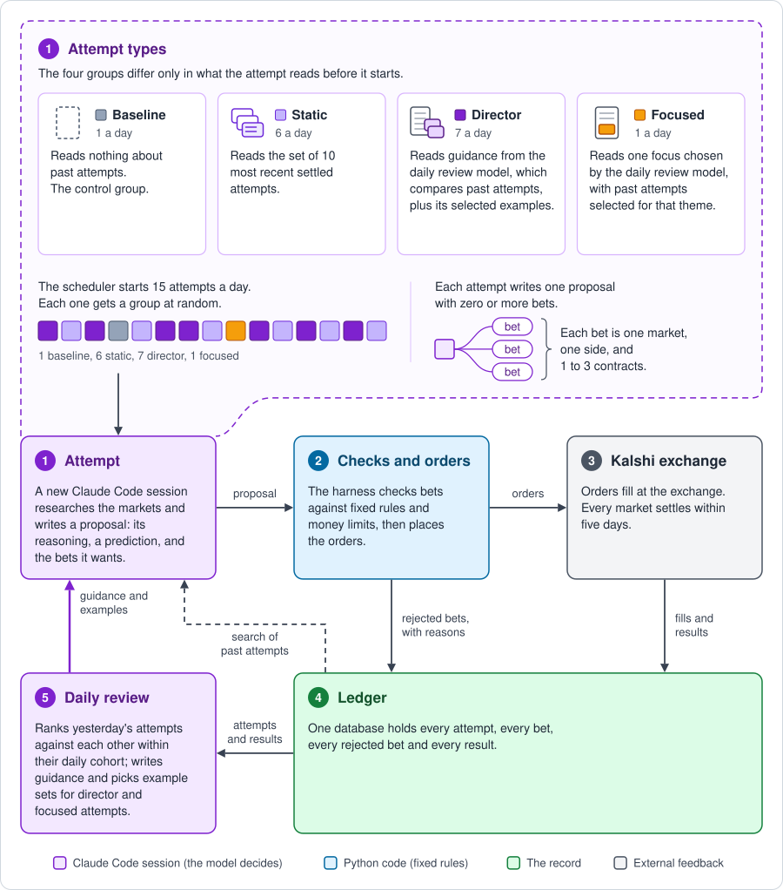

# prediction-market-agent

**Contents:** [Overview](#project-overview) · [Motivation](#motivation-for-this-project) · [Remarks](#remarks-and-takeaways) · [Results](#results-so-far) · [How it works](#how-it-works) · [Development](#how-the-project-was-built) · [Tests](#run-the-tests)

Independent AI agents, running through Claude Code, research Kalshi markets and propose real-money bets inside a Python harness. The harness enforces spending limits, places and settles orders, and keeps a searchable record of every attempt. Each agent run starts in a fresh workspace: it develops its own approach, drawing on written records of earlier attempts rather than extending a shared prediction codebase.

**The current iteration earned $34.20 after exchange fees across 130 settled bets in 15 days**, starting with $159.93 in the account. It won 72 of those bets when the prices paid implied about 60 wins. Under the fair-price model used in the analysis, a result this good would occur about 1 time in 350. It is a promising start across 136 attempts, with a longer run still ahead to test how the approach holds up.



| Key results from current iteration (V2), as of October 1, 2026 | |
|---|---|
| Profit after exchange fees | **+$34.20** across 130 settled bets in 15 days |
| Starting balance | $159.93 in cash; settled profit equals 21.4% of it |
| Activity | 136 attempts; 198 bets placed, of which 130 have settled |
| Bets won | **72 of 130**, versus about 60 implied by the prices paid |
| Profit per day | About $2.28 |
| Return on money staked | **21.6%**: $34.20 of profit on $158.45 staked across the settled bets |
| Tokens processed by the attempts | About **1.1 billion** in the current iteration |

The results below separate trading performance, model costs, and the evidence for learning from history. For the implementation, start with [How it works](#how-it-works) and the [repository layout](#repository-layout).

## Project overview

Fifteen times a day, the scheduler gives a new Claude Code session one objective: find a profitable opportunity among the available Kalshi markets. Each session is an **attempt**. It can search the web, retrieve live prices and source data, write and run analysis code, and build a model suited to its idea. Attempts given history receive past records up front and can query the ledger for earlier bets, reasoning, and outcomes. An attempt finishes with a proposal: the edge it believes it found, a prediction that can be checked later, and zero or more bets of one to three contracts each.

The **harness** turns that open-ended research into controlled execution. It validates proposals against fixed rules, applies spending limits, submits eligible orders, and tracks fills and settlement. Its nightly reconciliation rebuilds the account balance from the record and checks it against the exchange. The **ledger**, a searchable SQLite database, preserves the full trail: research, proposals, accepted and rejected bets, refusal reasons, and results after fees.

A separate Claude Code session, the **daily review**, turns that record into guidance for the next attempts. It compares yesterday's attempts against one another within their daily cohort, then revisits earlier cohorts once their outcomes have settled. These contrastive reviews rank approaches, identify useful examples, and select both general guidance and specific themes. The four attempt groups test different ways to use this experience: no history, recent history, review-selected guidance and examples, or examples organized around one focus. The model is not retrained; experience travels through the record and the context each new attempt receives.

## Motivation for this project

**Can an AI agent improve at a difficult, open-ended task by learning from a record of past attempts?** That is the central question. The task keeps moving: new markets appear, prices change, and new information changes which approaches are useful. My aim is to make accumulated experience useful in that changing environment, through both the history supplied to each attempt and tools for searching the ledger.

The independent-attempt structure builds on what I think of as coding agents’ **90/20 strength**: they can often deliver the first 90% of a solution in roughly 20% of the time and effort, while polishing the last 10% is much harder. Here, an attempt only needs to deliver useful research and a proposal; its analysis does not have to become a permanently maintained product. Many independent attempts put that first-pass strength to work repeatedly, while a larger sample helps us evaluate noisy outcomes. Combined with useful written experience, the aim is a stronger process over time.

**Kalshi provides an external score for that exploration.** The agent competes against live prices set by other traders, and the exchange determines settlement and cash payouts. It cannot award itself a better result by writing a persuasive explanation or changing a local test. Profit after exchange fees supplies a concrete objective while leaving the research approach open. Markets selected by the harness resolve within five days, so feedback arrives quickly. A single loss may be bad luck, and a single win may be too; repeated attempts give the review process more evidence to work with.

The engineering question is how to preserve that freedom while making the system dependable. Research belongs to the agents; validation, execution, accounting, and spending limits belong to the harness. This separation lets me experiment with how agents work and learn while keeping financial actions explicit and auditable.

## Remarks and takeaways

### The system performs well despite implementation rough edges

I have been surprised by how well the overall setup—independent attempts inside a harness with objective outcome feedback and a history of earlier attempts—has performed despite rough edges in the implementation. For example, a review found that the short history records supplied only the first 320 characters of each attempt’s profit argument, often omitting the method behind it. The system still produced strong bets and positive returns with that incomplete context.

### My biggest contribution as the human developer

I find Claude Code still struggles with development that requires prioritization, intuition about which steps matter, and a broader sense of the project’s direction. I still need to make those judgments: which problems to fix, what to revise or rebuild, and what to pursue next. That direction-setting is my biggest contribution as the human developer.

### Opus and Fable performed about the same per dollar staked

Across every real-money attempt in both versions, Opus and Fable returned about the same on the money they staked.

| Model family | Attempts | Settled bets | Staked | Profit after fees | Return on money staked | Model cost per attempt |
|---|---|---|---|---|---|---|
| Opus (5 and 5.5) | 173 | 233 | $213.04 | +$36.61 | **17.2%** | $10.61 |
| Fable (5 and 5.1) | 59 | 126 | $57.44 | +$8.87 | **15.4%** | $18.75 |

### Principles and priors provide an initial seed

The version 1 priors page gave attempts my judgment about which kinds of bets were likely to make money and which were not, so that agents did not have to discover every principle from scratch. Half of the version 1 attempts were shown the page and half were not, assigned in rotation.

| Version 1 attempts | Attempts | Settled bets | Profit after fees | Profit per attempt | Return on money staked |
|---|---|---|---|---|---|
| Shown the priors page | 96 | 113 | +$10.11 | $0.11 | **16.1%** |
| Not shown the page | 96 | 241 | +$0.38 | $0.00 | **0.4%** |

Version 2 replaced the priors page with a shorter principles page, which every group except the control group reads.

## Previous work: the NBA betting agent

An earlier NBA betting project used three layers of agents: builders implementing features, daily planners directing the work, and a twice-weekly meta agent proposing prediction ideas, architecture changes, and changes to the planning process itself. All worked toward one growing codebase. With earlier models and a looser development process, errors accumulated and the predictions were disappointing. The lesson was how difficult it is to combine open-ended agent development with reliable maintenance across sessions. That experience motivated the current design: a stable harness around independent attempts, with written experience carrying forward what is useful.

## Results so far

Trading results use the October 1, 2026 snapshot and count settled bets only. Each contract pays $1 if its side wins; a 40-cent price roughly implies a 40% chance. Current bets hold one to three contracts, with an average settled stake of about $1.22.

**Starting capital and cumulative stakes measure different things.** The first live iteration began with $30.16 in cash, received a $20.00 deposit on August 10, and earned $10.49. The current iteration began with $159.93 in cash and has earned $34.20 on settled bets. As bets settle, the same funds can be used again. Cumulative stakes add up that repeated activity; they are not the amount deposited into the account.

| | Paper phase* | Version 1 | Current iteration (V2) |
|---|---|---|---|
| Dates | Jul 13 to Jul 31 | Jul 31 to Aug 30 | Sep 17 to Oct 1 |
| Money | Simulated | Real | Real |
| Starting balance | — | $30.16, plus $20.00 deposited Aug 10 | $159.93 |
| Attempts | 47 | 192 | 136 |
| Settled bets | 154 | 354 | 130 |
| Won and lost | 74 and 80 | 179 and 174, and 1 paid at a set value | 72 and 58 |
| Cumulative stakes on settled bets | $121.92 | $165.41 | $158.45 |
| Exchange fees | $5.35 (simulated) | $3.92 | $3.35 |
| Profit after exchange fees | +$9.73 (simulated) | +$10.49 | +$34.20 |
| Profit per attempt | $0.21 (simulated) | $0.05 | $0.25 |
| **Return on money staked** | **8.0%** (simulated) | **6.3%** | **21.6%** |
| Settled profit / money in the account | — | 20.9% of $50.16 | 21.4% of $159.93 |

*Paper phase: simulated data from an early pilot, including simulated fills and fees; it is not evidence of live trading performance.*

Return on money staked divides profit after fees by the amount staked on settled bets, so it does not depend on how many attempts ran or how many bets each placed. The last row divides the same profit by the money in the account: the starting balance, plus the August 10 deposit for version 1. Both percentages exclude model costs and gains or losses on open positions; for the current iteration, they are not a total account return. Another 68 bets, with $108.73 staked, were open at the snapshot and are excluded from the settled results.

### How strong the evidence is

The current iteration has a clear positive result: 72 wins from 130 settled bets, against about 60 wins implied by the prices paid, and $34.20 in profit after exchange fees. Under the analysis's fair-price assumptions, a result this good occurs about 1 time in 350. When bets tied to the same underlying outcome are grouped together to account for their dependence, the figure is about 1 time in 120.

That is encouraging evidence from 136 attempts over 15 days. A longer run will show how performance holds up across changing markets and whether particular ways of supplying history consistently outperform the control group. The system has demonstrated profitable trading in this period; the comparisons below test which parts of the approach contribute to it.

### Current iteration by model and effort

Every attempt in the current iteration ran Opus 5 at high effort until September 26. From September 27, each day's random draw assigns every attempt one of three settings, and they run side by side.

| Model and effort | Attempts | Settled bets | Profit after fees | Profit per attempt | Return on money staked | Model cost per attempt |
|---|---|---|---|---|---|---|
| Opus 5, high | 76 | 84 | +$21.19 | $0.28 | **21.3%** | $7.33 |
| Opus 5.5, high | 27 | 19 | +$11.93 | $0.44 | **52.8%** | $3.54 |
| Opus 5.5, max | 25 | 22 | -$2.37 | -$0.09 | **-7.0%** | $10.66 |
| Fable 5.1, max | 8 | 5 | +$3.45 | $0.43 | **141.9%** | $10.52 |
| All settings | 136 | 130 | +$34.20 | $0.25 | **21.6%** | $7.39 |

Opus 5.5 at high effort has the best return so far, at about a third of the model cost of max effort. Most of the max-effort bets were still open, Fable has only 5 settled bets, and a test that shuffles the labels finds differences this large about 1 time in 11 by chance, so the ranking can still change.

### Current iteration by attempt group

Each attempt is assigned at random to one of four groups. The groups differ only in what the attempt reads before it looks at a market, and the diagram above shows each one.

| Group | What it reads first | Attempts | Settled bets | Won and lost | Staked | Profit after fees | Profit per attempt | Return on money staked |
|---|---|---|---|---|---|---|---|---|
| Baseline | Nothing about past attempts. The control group | 9 | 8 | 1 and 7 | $4.51 | -$1.67 | -$0.19 | **-37.2%** |
| Static | The set of 10 most recent settled attempts | 76 | 71 | 40 and 31 | $85.48 | +$23.82 | $0.31 | **27.9%** |
| Director | The daily review's guidance and selected past attempts | 42 | 45 | 30 and 15 | $65.79 | +$12.81 | $0.31 | **19.5%** |
| Focused | One focus chosen by the daily review, with past attempts selected for that theme | 9 | 6 | 1 and 5 | $2.67 | -$0.75 | -$0.08 | **-28.1%** |

The static and director groups have produced the strongest results so far. The baseline and focused groups each have fewer than 10 settled bets, and the differences are not yet statistically significant. Continued comparison will test whether supplying history improves performance and which form of history is most useful.

### Current iteration by market category

| Category | Settled bets | Won and lost | Staked | Profit after fees |
|---|---|---|---|---|
| Science and technology | 34 | 19 and 15 | $38.81 | +$14.02 |
| Climate and weather | 52 | 25 and 27 | $56.67 | +$13.23 |
| Economics | 43 | 27 and 16 | $61.37 | +$6.57 |
| Financials | 1 | 1 and 0 | $1.60 | +$0.38 |

### What the model time cost

The current iteration's Claude Code sessions have an estimated list-price cost of about $1,040, roughly 30 times the trading profit. They run under a subscription, so this estimate is not the cash paid. About 1.1 billion tokens were processed; much of that usage is repeated context billed at the provider's reduced cache rate. The first live iteration processed about 2.5 billion tokens.

At these deliberately small stakes, the trading profit would not cover model use at list prices. The experiment measures the quality of the betting process; commercial viability would also depend on compute costs, market liquidity, and how performance changes with stake size. The model-and-effort comparison above helps measure the tradeoff between research cost and results.

### The full ledger

The SQLite ledger records every proposed bet, including rejected bets and their reasons. CSV exports for each phase are planned for `results/`, with an export script that checks their totals against the ledger. Those files are not yet included in this repository; adding them will let readers inspect the individual bets behind the tables above.

## How it works

1. The scheduler starts an attempt. A job runs every 15 minutes and starts a new Claude Code session at each of 15 set times a day. A random draw, stored each morning, assigns every attempt to a group and to a model setting.
2. The attempt researches the markets and writes a proposal. It can search the web, write and run code, read live prices, and search the ledger of past attempts. The proposal holds its reasoning, a prediction written before any result is known, and a list of bets. A proposal with no bets is a valid result.
3. The harness validates the proposal and places the orders. Nine rules check each bet, and the current configuration limits spending to $11.20 per attempt, $4 per market per day, and $56 per day. Bets that pass are sent to the exchange, and bets that fail are recorded with the reason.
4. The exchange settles each bet, and the ledger records the result with the profit or loss after fees.
5. The daily review chooses what future attempts read. One Claude Code session a day compares and ranks yesterday's attempts within their daily cohort, revisits settled cohorts, writes guidance, and selects examples for director and focused attempts. Code rejects any guidance that tries to set how many bets to place or how large they are.

These responsibilities keep research flexible and execution predictable.

| The model decides | Code decides | I decide |
|---|---|---|
| What to research and whether to bet | When attempts run and which group each one is in | Whether real trading is on |
| Which market, which side, what price, and 1 to 3 contracts | Whether a proposal passes the rules and the limits | The spending limits and the schedule |
| The written reasoning and prediction | How orders are placed, settled, and recorded | When to restart after a stop |
| The daily ranking, guidance, and examples | Whether the books match the exchange, and whether to stop | Deposits and withdrawals |

### Safety controls

- Real orders need a setting that only I can turn on, and no code path writes it.
- Spending limits apply to every order. Orders are also refused when account value, including open positions, falls below half of the live starting balance.
- A nightly check compares the ledger with the exchange balance. A difference over $1, or any failed cross-check, stops new attempts and new orders until I restart the system.
- Stopping the system stops spending only. Settlement, the nightly check, and backups keep running.

## How the project was built

I designed and built the project with AI coding agents. I wrote the founding brief, chose the architecture and experiments, prioritized changes, and retained control over live operation and spending limits. Claude Code agents wrote most of the implementation, specifications, and reviews. I used separate agent reviews to challenge the work before accepting it, and tests to check the execution and accounting paths. The `docs/` folder holds a selection of those documents, listed in [`docs/README.md`](docs/README.md).

Development began in July 2026 in a private repository. The planned public release will start from a snapshot, with its commit history beginning at publication. It will include the implementation and selected design documents; the principles and priors pages, which guide attempts toward possible sources of an edge, are excluded.

## Repository layout

```
src/betting_agent/
  cli.py        operator commands and the scheduler pass that runs every 15 minutes
  bt.py         the read-only tools that an attempt can call
  board.py      an hourly snapshot of the markets the account can trade
  sessions.py   starts a Claude Code session with no screen, enforces its time limit, and checks its output
  harness/      the pipeline: attempt, validate, execute, settle, reconcile, director, safety
  kalshi/       the exchange client, and a fake exchange used by the tests
  ledger/       the SQLite ledger, its schema changes, and the views of past attempts
  prompts/      the two prompts: one for an attempt and one for the daily review
tests/          1,678 tests, including a run of the whole pipeline with a fake exchange and a fake agent
docs/           the founding brief, the rebuild specification, a review, and the operating guide
ops/            the scheduled job definition for macOS
```

A reader who wants to follow the money path can start with `prompts/attempt.md`, then read `harness/validate.py`, `harness/execute.py`, and `harness/safety.py`, and then `harness/reconcile.py`.

## Run the tests

You can inspect the execution path without placing a bet. The tests use a fake exchange and fake agent, need no exchange account or Claude Code subscription, and take about one minute.

```bash
python3.12 -m venv .venv
.venv/bin/pip install -e ".[dev]"
.venv/bin/pytest -q
```

The file `tests/test_e2e.py` runs the whole pipeline against the fake exchange and the fake agent. It covers an attempt, the checks, order placement, settlement, the nightly check, and the daily review.

```bash
.venv/bin/pytest tests/test_e2e.py -v
```

## Project documents

| Document | What it is |
|---|---|
| [`docs/proposal.md`](docs/proposal.md) | The founding brief from July 6, 2026, with the research question and the first objections to it |
| [`docs/22-rebuild-spec-sep13.md`](docs/22-rebuild-spec-sep13.md) | The specification for version 2 |
| [`docs/31-attempt-review-sep25.md`](docs/31-attempt-review-sep25.md) | A review of the first 72 attempts of version 2, in which every claim was tested by a second reader |

The [index in `docs/`](docs/README.md) lists every published document. The [operating guide](docs/operating.md) covers setup and day-to-day commands.

## Disclaimer

The project is a personal research project. It is not financial advice, and past results say nothing about future results. It is not affiliated with Kalshi or endorsed by Kalshi. The configuration file in the repository has real trading turned on, because it is the configuration that runs. Anyone else who runs the code should set `live_trading = false` first.

## License

The code is released under the MIT License.
